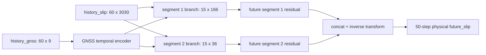

<!-- Generated by scripts/build_bilingual_paper_drafts.py on 2026-06-28 -->

本文档是面向投稿前讨论的中文论文初稿。它保留当前项目已经实现并验证的章节、图件、表格和实验结论；未完成的顶刊级补充实验单独列入 `docs/top_journal_reviewer_gap_audit_zh.md`。

# 几何感知慢滑移未来滑移场预测：中文论文初稿

更新时间：2026-06-28

> 本文档是最终论文写作母稿。它整合旧论文可沿用的数据背景、重构后的 data contract、
> PAI-DSW 全量训练结果、完整消融矩阵、文献调研和应用边界。若后续投稿需要英文稿，可
> 以本文档为结构源翻译和压缩。

## 题目

**Geometry-Aware Multi-Step Forecasting of Synthetic Slow Slip Evolution from Sparse Geodetic Histories**

中文工作题目：

**面向慢滑移演化的几何感知多步断层滑移预测：基于稀疏 GNSS 与历史滑移的全量合成事件实验**

## 摘要

慢滑移事件（slow slip events, SSEs）是不以强震波辐射为主要表现形式的瞬态断层滑移过程，
其时空演化能够反映板块边界或活动断层上的应力调整，对区域地震危险性背景分析、GNSS
形变监测和灾害情景研判具有重要意义。已有深度学习研究主要聚焦于从 GNSS 时间序列中检测
SSE 是否发生、恢复被噪声掩蔽的测地信号，或学习面向地震预警的空间测地表征；相比之下，
直接预测未来断层滑移场演化的多步 forecasting 任务仍较少被系统验证。

本文将早期混合反演、重构和预测目标的原型系统重构为明确的 future slip forecasting 闭环：
给定历史 GNSS 观测和历史断层滑移，预测未来 50 个时间步的断层滑移场。为避免旧方案中
逐维 z-score slip target 与非负输出约束之间的物理冲突，本文采用
`log1p(slip / slip_scale)` 作为训练目标，并在所有评价中反变换回物理滑移量。针对研究区
两个不连续子断层，本文提出 segmented residual 网络，分别建模 `15x166` 与 `15x36` 两个
子断层并融合 GNSS history，从而避免把两段断层强行拼成连续 `15x202` 图像造成伪邻接。

在 6000 个合成慢滑移事件、原始规模 74.202 GiB 的全量 catalog 上，本文完成了 raw 数据与
压缩训练包的逐事件审计，并在 random 与 blocked 两类 split 上完成 PAI-DSW A10 全量训练。
主模型在 h50 test RMSE 上相对 persistence baseline 分别提升 97.60% 与 97.50%，同时显著
降低总滑移矩代理量 M0 的相对误差。完整消融矩阵表明：history slip 是当前任务的主导信息源，
GNSS history 提供边际约束；GNSS-only 预测在两个 split 上均失败；M0 auxiliary loss 虽不
保证最低像素 RMSE，却显著改善物理释放规模的一致性。结果说明，在受控合成场景中，如果
当前滑移状态可由反演或同化系统提供，几何感知网络能够有效预测短期慢滑移演化。本文不声称
真实地震预测或业务级预警，而是为慢滑移状态估计、GNSS 辅助反演、地震危险性背景分析和
灾害情景建模提供可复现基线。

## 图件总览


## 1. 引言

慢滑移事件位于稳定蠕滑和快速地震破裂之间，是理解断层摩擦、板块耦合和应力迁移的重要窗口。
SSE 通常不产生强烈地震波，却能在数天到数月尺度内造成可观地表形变，并改变邻近断层区域的
应力状态。随着连续 GNSS 观测网络的发展，研究者可以以更高时间分辨率追踪地表形变异常，并
进一步通过物理反演或机器学习方法推断潜在断层滑移过程。

深度学习已经被用于 SSE 检测、测地时间序列去噪和地震预警特征学习。例如，多站 GNSS
CNN/attention 框架已经证明，合成训练集与深度时空模型可用于从 raw GNSS 中检测 Cascadia
SSE；图时空去噪模型也能从噪声 GNSS 序列中恢复与慢滑移相关的微弱位移。这些工作共同说明，
GNSS 时间序列中确实存在可被神经网络学习的慢滑移信号。然而，检测“事件是否发生”和预测
“断层滑移场将如何继续演化”是两个不同层级的问题。前者输出事件标签、时间窗或检测概率；
后者需要在物理空间中预测未来滑移分布，并接受物理单位指标检验。

本文关注后一个问题。我们不把模型输出解释为真实地震预警，也不声称可以预测破坏性地震发生
时间，而是研究一个更基础、也更可验证的建模层：在已知断层几何和受控合成数据条件下，历史
GNSS 与历史滑移是否足以预测未来 50 步断层滑移演化。这一问题具有双重意义。首先，它检验
历史滑移场中是否包含可学习的短期演化信息。其次，它为真实业务中可能出现的“由 GNSS 反演或
同化得到当前滑移状态，再预测短期演化”的工作流提供算法原型。

早期项目失败的原因并不只是模型容量或训练轮数不足，而是任务定义与物理约束之间存在不一致。
旧方案将非负滑移逐维 z-score 后再使用 softplus 非负输出，会使训练目标空间与物理输出空间
发生冲突；每事件 GNSS RobustScaler 也会消除事件间真实幅值差异，不利于学习测地观测与滑移
规模之间的物理耦合。本文因此重新定义数据契约、目标变换、模型结构和评价指标，将反演与
GNSS 重构降级为辅助证据，把 future slip forecasting 作为唯一主任务。

本文贡献如下：

1. 提出一个面向合成 SSE 的可复现 future slip forecasting 闭环，包含全量数据审计、
   baseline、small overfit、full train、物理指标和 demo 报告。
2. 采用与非负滑移相容的 `log1p` 目标变换，并使用训练集全局 GNSS 统计量归一化，修正旧方案
   中的尺度与输出冲突。
3. 提出两子断层几何感知 segmented residual 网络，避免将不连续断层强行拼接为连续图像。
4. 在 6000 事件全量合成 catalog 上完成 random 与 blocked 双 split 主模型训练和 14 项全量
   消融实验，证明主模型显著超过 persistence baseline，并明确指出 GNSS-only forecasting
   在当前设定下不可行。

## 2. 相关工作

### 2.1 基于 GNSS 的慢滑移事件检测

现有 SSE 深度学习研究中，检测任务最为成熟。Costantino 等人的多站 GNSS 深度学习检测器使用
逼真的合成训练集和 convolution/attention 结构，从 raw geodetic time series 中检测 Cascadia
SSE。该工作支撑了“合成测地数据 + 深度时空模型”用于 SSE 分析的合理性，但其输出是事件检测
结果，而不是未来断层滑移场。Wang 等人的 Cascadia GNSS 深度检测研究使用 vbICA 提升信噪比，
再以 BiLSTM 和 attention 机制识别 SSE，也进一步说明深度序列模型能从 GNSS 中提取慢滑移信号。
这些研究为本文提供了数据和模型动机，但不直接解决 fault slip field forecasting。

### 2.2 测地时间序列去噪与图学习

GNSS 原始序列包含仪器噪声、环境负载、季节项、站点异常和非构造信号。SSEdenoiser 等图时空
网络方法将测站网络结构与时间依赖结合，从 noisy GNSS 中恢复 SSE 相关位移。该方向与本文高度
相关，因为高质量 GNSS 表征是后续反演和预测的基础；但去噪模型的输出仍是观测空间中的位移，
而不是断层滑移场的未来演化预测。

### 2.3 测地反演与断层源建模

传统 GNSS-to-slip 反演依赖位错 Green's functions、正则化优化和多源观测约束。相关研究表明，
真实断层滑移反演往往受到台站几何、深部分辨率、多源数据融合和先验约束影响。本文当前不声称
实现专业级 GNSS-only 反演；`demo_inversion_proxy.py` 只是 ridge-regression proxy，用于展示
未来系统中可能存在的 GNSS-to-slip 数据流。本文主贡献是 future slip forecasting，而不是取代
物理反演。

### 2.4 通用时间序列预测模型

TimesNet、PatchTST、iTransformer、Chronos、TimesFM 等通用时序模型推动了长序列预测、patch
表示、变量维度重排和基础模型的发展。它们为后续 baseline 提供重要参考，但本文的核心结构
先验来自断层几何：3030 维 slip 并不是无结构多变量序列，而是两个已知形状的不连续子断层。
因此本文优先验证 geometry-aware 模型，再将通用时序 backbone 作为后续扩展方向。

### 2.5 研究缺口

综合上述工作，本文的研究缺口可表述为：

> Existing deep-learning studies on slow slip events mainly address event
> detection, geodetic denoising, or alert-oriented representation learning.
> Direct multi-step forecasting of the future fault slip field under a known
> two-subfault geometry, evaluated in physical slip units against persistence
> and blocked-split baselines, remains less explored.

对应中文表述为：现有慢滑移深度学习研究主要集中于事件检测、测地序列去噪或预警特征学习；在
已知两子断层几何下，直接预测未来断层滑移场，并以物理量指标和 random/blocked 双划分进行
评价的工作仍相对不足。

## 3. 数据与问题定义

### 3.1 数据规模与审计

本文使用 6000 个合成慢滑移事件。原始数据目录为 `data/`，分为 12 个子目录；原始总大小为
`79,673,958,000` bytes，即 `74.202 GiB`。每个事件包含 `T=273` 个时间步和 `3040` 列，其中
slip 为 3030 维，GNSS 为 9 维。3030 维 slip 对应两个不连续子断层：

- segment 1: `15x166`
- segment 2: `15x36`

为提高训练和远程传输效率，本文使用压缩训练包 `hf_dataset_package/`。该训练包约 `2.838 GiB`，
包含 `manifest.csv`、`manifest.jsonl` 和 `events/shard_*.npz`。它不是抽样子集，而是完整
6000 事件的全量压缩表示。全量审计结果为：

| 项目 | 数值 |
| --- | ---: |
| Raw event count | 6000 |
| Manifest event count | 6000 |
| Raw total bytes | 79,673,958,000 |
| Package total bytes | 3,047,677,208 |
| Event IDs | continuous 1..6000 |
| Full raw-vs-package comparisons | 6000 |
| Exact comparison failures | 0 |
| Raw shape | `[273, 3040]` |
| Package slip/GNSS shapes | `[273, 3030]` / `[273, 9]` |

### 3.2 Forecasting 任务

本文固定主任务为：

```text
history_gnss + history_slip -> future_slip
```

默认窗口为：

```text
history_steps = 60
forecast_horizon = 50
input = history_slip[0:60] + history_gnss[0:60]
target = future_slip[60:110]
```

Dataset 输出字段被显式拆分为：

- `history_gnss`
- `history_slip`
- `future_slip`
- `future_gnss`
- `metadata`

其中训练主路径只优化 `history_gnss + history_slip -> future_slip`。`future_gnss` 保留给后续
辅助任务或一致性检查。

### 3.3 数据划分

本文使用两类 split：

- `random`: 检验同分布泛化。
- `blocked`: 按事件编号/生成顺序分块，检验事件族或生成顺序漂移下的稳健性。

publication gate 预设为：

- random h50 RMSE 至少比 persistence 改善 5%；
- blocked h50 RMSE 至少比 persistence 改善 2%；
- M0 error 不得相对 persistence 恶化超过 10%。

## 4. 方法

### 4.1 滑移目标变换

断层滑移在物理上非负。旧方案使用 z-score slip target 后再接 softplus 非负输出，会导致训练
目标中大量负值与非负输出空间冲突。本文改用：

```text
encoded_slip = log1p(slip / slip_scale)
physical_slip = expm1(encoded_slip) * slip_scale
```

其中 `slip_scale` 由训练集活跃滑移分位数估计。该变换保留非负性，压缩长尾幅值，并使训练
损失与物理空间评价之间保持可逆关系。

### 4.2 GNSS 全局归一化

本文仅使用训练集全局均值与标准差归一化 GNSS。这样既避免测试集泄漏，也保留事件间幅值差异。
相比之下，每事件 RobustScaler 会将每个事件内部重新定标，削弱 GNSS 幅值与 slip 规模之间的
物理对应关系。

### 4.3 Segmented Residual 网络

模型将两段 slip 分别 reshape 并送入独立卷积分支，避免普通 `15x202` 卷积把两个不连续子断层
边界处的网格点视为相邻。GNSS history 由 temporal encoder 提取特征后广播到两个子断层分支。
输出采用 residual 形式，从最后一个历史 slip 状态出发预测未来增量，使 persistence 成为自然
起点。

简化流程为：



### 4.4 损失函数与物理指标

训练损失包含 encoded MSE 和可选 M0 auxiliary loss。M0 在本文中作为总滑移矩代理量：

```text
M0_proxy(t) = sum_i slip_i(t)
```

M0 loss 约束模型不仅在网格点级匹配 slip field，也能匹配整体事件释放趋势。最终报告指标包括：

- physical RMSE；
- physical R2；
- M0 relative absolute error；
- zero/mean/persistence baselines at h=1/5/10/30/50；
- h50 相对 persistence 的 RMSE 改善率。

## 5. 实验设计

### 5.1 Baselines

本文使用三类物理空间 baseline：

1. `zero`: 未来 slip 全为 0。
2. `mean`: 训练集未来窗口均值。
3. `persistence`: 未来保持最后一个历史 slip 状态。

persistence 是最关键 baseline，因为它代表“短期滑移状态不再变化”的强基线假设。

### 5.2 Small Overfit

small overfit 在 16-32 个事件上验证 data contract、loss、inverse transform、M0 指标和
checkpoint 报告闭环。如果模型不能在小样本上明显超过 persistence，则说明任务实现存在问题。
当前 small overfit 已通过，为 full training 提供基础可信度。

### 5.3 Full Training

full training 使用全量 6000 事件。主模型设置为：

| 项目 | 设置 |
| --- | --- |
| model | `segmented_residual` |
| input | `history_slip + history_gnss` |
| target | 50-step `future_slip` |
| forecast_start | 60 |
| forecast_horizon | 50 |
| epochs | 50 |
| batch_size | 16 |
| hidden_channels | 64 |
| m0_loss_weight | 0.005 |
| hardware | PAI-DSW NVIDIA A10 |

### 5.4 消融实验

完整消融矩阵包含：

| 类别 | 实验 | 目的 |
| --- | --- | --- |
| architecture | `plain` | 检验把两子断层拼成 `15x202` 的伪邻接影响 |
| architecture | `segmented` | 检验两子断层独立卷积但无 residual 强化的效果 |
| architecture | `segmented_residual` | 默认主模型 |
| input | `no_gnss` | 衡量 GNSS history 的边际增益 |
| input | `gnss_only` | 检验无 history slip 时任务是否可解 |
| input | `last_slip_only` | 衡量完整 history slip 是否必要 |
| loss | `no_m0_loss` | 验证 M0 auxiliary loss 对物理一致性的影响 |

## 6. 结果

### 6.1 主模型结果

| Split | Model h50 RMSE | Persistence h50 RMSE | Improvement | R2 | M0 rel abs | Gate |
| --- | ---: | ---: | ---: | ---: | ---: | --- |
| random | 0.00142173 | 0.0592355 | 97.60% | 0.999408 | 0.0155652 | PASS |
| blocked | 0.00152041 | 0.0608568 | 97.50% | 0.999359 | 0.0166794 | PASS |

主模型在 random 与 blocked 上均显著超过 persistence，说明在合成 catalog 和 history slip 可用
的设定下，未来 50 步 slip field 具有很强可学习性。persistence 在 h50 上表现差，说明未来
活跃滑移不能简单由最后一帧外推；模型同时降低 RMSE 与 M0 error，表明其学习到局部 slip 分布
和整体释放趋势。

### 6.2 架构消融

| Run | Split | h50 RMSE | Gain | R2 | M0 rel abs | Gate |
| --- | --- | ---: | ---: | ---: | ---: | --- |
| `model_plain_full` | random | 0.004315 | 92.72% | 0.994546 | 0.013652 | PASS |
| `model_plain_full` | blocked | 0.005755 | 90.54% | 0.990813 | 0.028160 | PASS |
| `model_segmented_full` | random | 0.004737 | 92.00% | 0.993428 | 0.023861 | PASS |
| `model_segmented_full` | blocked | 0.005065 | 91.68% | 0.992884 | 0.032376 | PASS |
| `main_residual_full` | random | 0.001422 | 97.60% | 0.999408 | 0.015565 | PASS |
| `main_residual_full` | blocked | 0.001520 | 97.50% | 0.999359 | 0.016679 | PASS |

plain 与 segmented 都明显超过 persistence，但 h50 RMSE 约为 `segmented_residual` 的 3-4 倍。
这说明 residual 预测头和归一化/残差结构是高精度 future slip forecasting 的主要增益来源。
几何拆分的收益主要体现在 blocked 泛化侧，不能简单宣称它在所有指标上都优于 plain；更稳妥的
结论是：两子断层拆分改善结构泛化，而 residual 机制是核心性能来源。

### 6.3 输入消融

| Run | Split | Input | h50 RMSE | Gain | R2 | M0 rel abs | Gate |
| --- | --- | --- | ---: | ---: | ---: | ---: | --- |
| `ablate_no_gnss` | random | no_gnss | 0.002351 | 96.03% | 0.998382 | 0.027774 | PASS |
| `ablate_no_gnss` | blocked | no_gnss | 0.001927 | 96.83% | 0.998970 | 0.017310 | PASS |
| `ablate_last_slip_only` | random | last_slip_only | 0.002089 | 96.47% | 0.998722 | 0.060937 | PASS |
| `ablate_last_slip_only` | blocked | last_slip_only | 0.003041 | 95.00% | 0.997434 | 0.032517 | PASS |
| `ablate_gnss_only` | random | gnss_only | 0.060166 | -1.57% | -0.060367 | 1.000000 | FAIL |
| `ablate_gnss_only` | blocked | gnss_only | 0.061813 | -1.57% | -0.059933 | 1.000000 | FAIL |

`no_gnss` 仍能通过 gate，说明 history slip 是当前任务的主导信息源；但 full input 在 random
和 blocked 上仍更好，说明 GNSS history 提供稳定边际约束。`last_slip_only` 也显著超过
persistence，说明最后一帧滑移状态具有强短期外推信息；但它的 M0 error 和 blocked RMSE 均
弱于 full input，不能作为最终方案。`gnss_only` 在两个 split 上均失败，说明仅凭三站 GNSS
history 无法在当前设定下恢复未来完整 slip field；真实业务应用必须依赖反演、同化或其他状态
估计方法先获得 history slip。

### 6.4 Loss 消融

| Run | Split | M0 loss | h50 RMSE | Gain | R2 | M0 rel abs | Gate |
| --- | --- | ---: | ---: | ---: | ---: | ---: | --- |
| `main_residual_full` | random | 0.005 | 0.001422 | 97.60% | 0.999408 | 0.015565 | PASS |
| `main_residual_full` | blocked | 0.005 | 0.001520 | 97.50% | 0.999359 | 0.016679 | PASS |
| `ablate_no_m0_loss` | random | 0 | 0.001121 | 98.11% | 0.999632 | 0.059485 | PASS |
| `ablate_no_m0_loss` | blocked | 0 | 0.002783 | 95.43% | 0.997852 | 0.107937 | PASS |

移除 M0 loss 后，random split 的像素级 RMSE 进一步降低，但 M0 error 明显升高；blocked
split 同时出现 RMSE 与 M0 error 退化。M0 auxiliary loss 的主要价值不是机械地降低 RMSE，而
是约束整体滑移矩代理量，使预测在物理释放规模上更稳。考虑本文目标包含物理一致性，默认主模型
保留 `m0_loss_weight=0.005`。

## 7. 研究意义与灾害应用边界

慢滑移预测对地震预警预报的意义主要体现在状态估计和情景分析，而不是直接发布警报。破坏性
地震发生涉及复杂多尺度断层物理过程，不能由单一合成数据模型直接判定。然而，SSE 的时空演化
能够提供断层应力调整、板块耦合变化和潜在触发条件的重要背景信息。

本文方法未来可能服务于：

1. 区域应力状态监测：预测未来 slip evolution 可作为断层慢变量状态估计的一部分。
2. 地震危险性背景分析：SSE 演化可辅助判断某些区域应力加载或释放是否异常。
3. 次生灾害情景研判：在地震、海啸、滑坡等链式灾害分析中，断层滑移状态可作为场景输入。
4. GNSS 业务系统辅助：模型可用于反演初始化、异常窗口筛查和情景库快速生成。
5. 物理模型耦合：未来可与摩擦定律、弹性位错模型或数据同化系统结合。

本文当前不能用于：

- 真实地震发生时间预测；
- 业务级地震预警发布；
- 替代专业断层反演；
- 对未验证区域或真实噪声环境直接泛化。

## 8. 局限与未来工作

主要局限包括：

1. 数据为合成 catalog，尚未证明真实 GNSS 环境中的鲁棒性。
2. history slip 在真实应用中不是直接观测量，需要由反演或同化系统产生。
3. 当前 GNSS 站点数量少，尚未研究站点缺失、噪声增强和台站几何变化。
4. 当前反演 demo 是 proxy，不是主模型。
5. 当前消融矩阵仍局限于合成 catalog 内部的 random/blocked split，尚未覆盖跨区域和跨物理参数泛化。
6. 尚未加入不确定性量化，无法给出预测置信区间。

未来工作应包括：

- 训练 GNSS-only 或 GNSS-dominant slip estimation 模块；
- 加入真实噪声、缺测和台站扰动；
- 设计跨事件族、跨参数、跨区域 blocked split；
- 将通用时序 backbone 作为外部 baseline；
- 引入不确定性估计和物理一致性正则；
- 与真实 GNSS catalog 和地震活动数据进行后验对比。

## 9. 结论

本文从失败的慢滑移深度学习原型出发，识别并修正了任务定义、目标变换、归一化和断层几何表示
中的关键问题。通过新的 data contract、`log1p` slip target、全局 GNSS normalizer 和两子断层
`segmented_residual` 模型，项目形成了可复现的 future slip forecasting 闭环。全量 6000 事件
实验表明，主模型在 random 与 blocked split 上均显著超过 persistence baseline，并通过预设
publication gate。

这些结果支持本文核心结论：在受控合成慢滑移场景中，如果当前滑移状态和稀疏 GNSS 历史可用，
几何感知深度模型可以有效学习未来断层滑移演化。该工作为慢滑移状态估计、GNSS 辅助反演、
地震危险性背景分析和灾害情景建模提供了基础，但仍需真实数据验证和更严格的跨区域泛化研究后，
才能向业务应用推进。

## 参考文献与资料来源

1. Costantino 等，Multi-station deep learning on geodetic time series detects slow slip events in Cascadia. [Nature Communications Earth & Environment](https://www.nature.com/articles/s43247-023-01107-7)
2. Wang 等，Detecting slow slip events in the Cascadia subduction zone from GNSS time series using deep learning. [DOI: 10.1007/s10291-024-01701-y](https://doi.org/10.1007/s10291-024-01701-y)
3. Costantino 等，Denoising of Geodetic Time Series Using Spatiotemporal Graph Neural Networks: Application to Slow Slip Event Extraction. [arXiv:2405.03320](https://arxiv.org/abs/2405.03320)
4. Tong 等，Earthquake alerting based on spatial geodetic data by spatiotemporal information transformation learning. [PNAS](https://www.pnas.org/doi/10.1073/pnas.2302275120)
5. Wu 等，TimesNet: Temporal 2D-Variation Modeling for General Time Series Analysis. [arXiv:2210.02186](https://arxiv.org/abs/2210.02186)
6. Nie 等，A Time Series is Worth 64 Words: Long-term Forecasting with Transformers. [arXiv:2211.14730](https://arxiv.org/abs/2211.14730)
7. Liu 等，iTransformer: Inverted Transformers Are Effective for Time Series Forecasting. [arXiv:2310.06625](https://arxiv.org/abs/2310.06625)
8. Ansari 等，Chronos: Learning the Language of Time Series. [arXiv:2403.07815](https://arxiv.org/abs/2403.07815)
9. Google Research, TimesFM. [GitHub](https://github.com/google-research/timesfm)
10. THUML, Time-Series-Library. [GitHub](https://github.com/thuml/Time-Series-Library)

## 图表清单

| 编号 | 内容 | 当前状态 |
| --- | --- | --- |
| Figure 1 | 两子断层几何 + 三站 GNSS + 任务窗口 | 可由 `paper/` 图像重绘 |
| Figure 2 | Data contract 与模型流程 | 本文档含 Mermaid 草图，可转为论文图 |
| Figure 3 | `segmented_residual` 架构 | 本文档含 Mermaid 草图，可转为论文图 |
| Figure 4 | random/blocked 训练曲线 | `paper_figures_full/` 或 demo 输出 |
| Figure 5 | 事件级 forecast M0 curve 与 slip map | `demo_pages/forecast_random_full/figures/` |
| Table 1 | 数据集统计与审计结果 | 本文档已给出 |
| Table 2 | baseline vs main model | 本文档已给出 |
| Table 3 | architecture ablation | 本文档已给出 |
| Table 4 | input/loss ablation | 本文档已给出 |
